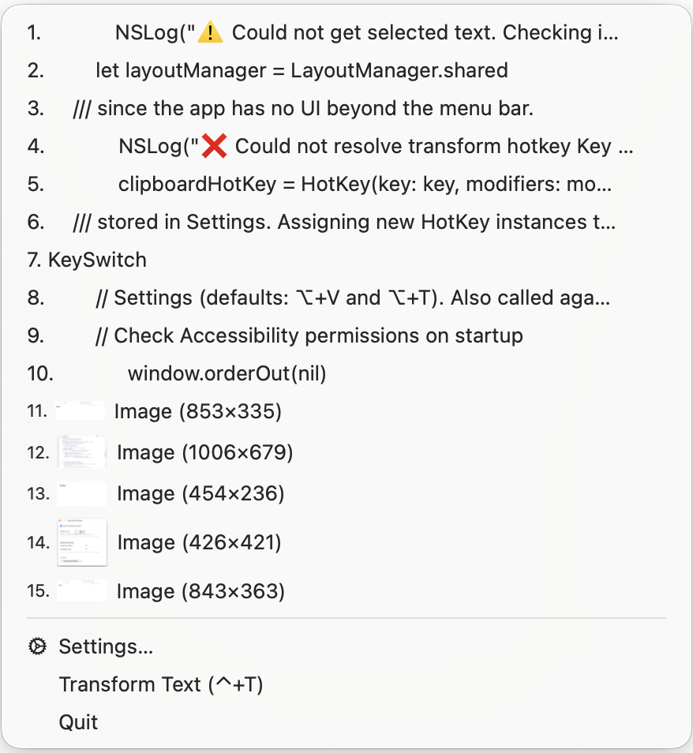
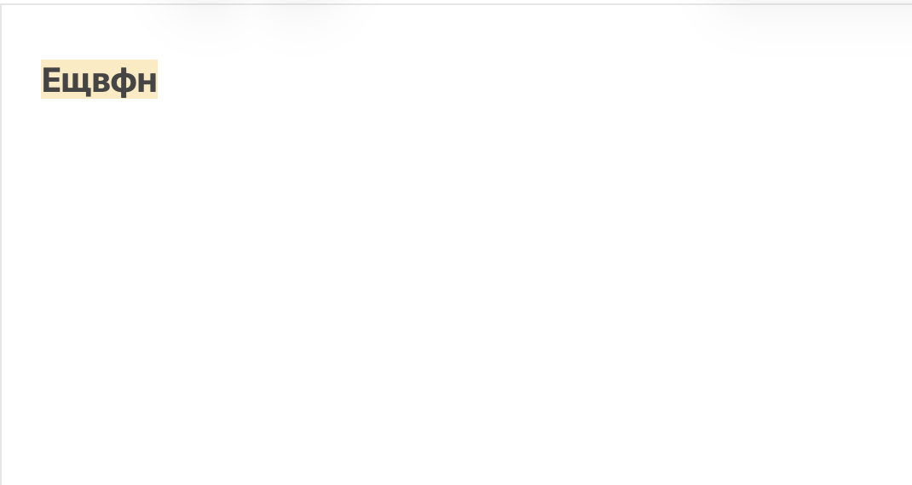
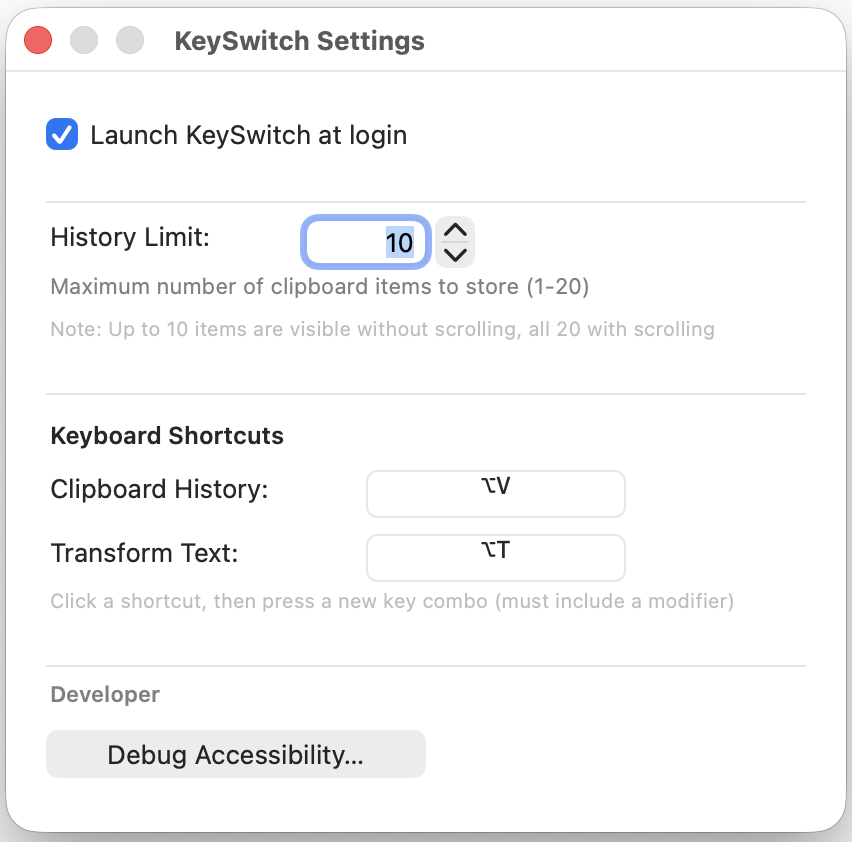

# KeySwitch

A free, lightweight macOS menu bar app that combines **clipboard history** with **automatic keyboard layout correction**. No Dock icon — runs from the status bar only.

  



## What it does

**Clipboard history** — every copy is saved. Open the menu from the status bar (or ⌥ Option + V), click any entry to copy it and paste it immediately into the focused app. Pin important entries to keep them at the top.

**Layout correction** — fixes text typed in the wrong keyboard layout. Select the garbled text, press ⌥ Option + T, and KeySwitch converts it to the correct layout in place.

| Before | After |
|--------|-------|
|  |  |

### Supported languages

- Ukrainian
- Russian
- Belarusian
- Bulgarian (Phonetic)
- Serbian ↔ Latin

## Installation

1. Go to [Releases](https://github.com/romankr-lab/keyswitch/releases) and download the latest `KeySwitch.dmg`.
2. Open the DMG and drag **KeySwitch.app** into **Applications**.
3. In Applications, **right-click → Open** the first time (required since the app isn't notarized with a paid Developer ID — this is expected for a free, independently distributed app).
4. Grant **Accessibility** access when prompted (**System Settings → Privacy & Security → Accessibility**). This is required for global hotkeys and layout correction.
5. On first launch, KeySwitch will also ask if you'd like it to start automatically at login.

### Build from source

```bash
git clone https://github.com/romankr-lab/keyswitch.git
cd keyswitch
./build_and_package.sh
```

This produces `KeySwitch.dmg` in the project folder. Or just open `KeySwitch.xcodeproj` in Xcode and build (⌘B).

## Default shortcuts

| Action | Shortcut |
|--------|----------|
| Open clipboard history menu | ⌥ Option + V |
| Fix keyboard layout of selected text | ⌥ Option + T |

Both shortcuts are configurable in Settings.

## Settings



Configure shortcuts, clipboard history size, enabled languages, and Launch at Login.

## Requirements

- macOS 14.0 or later
- Apple Silicon or Intel
- Accessibility permission (for global hotkeys and text correction)

## License

MIT — see [LICENSE](LICENSE).
